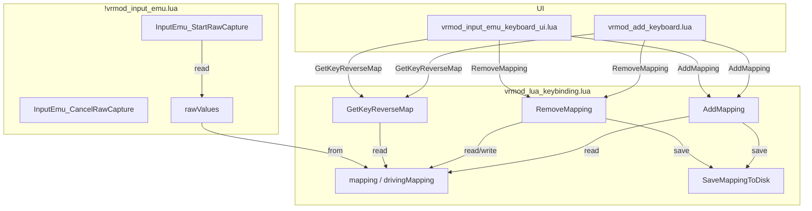

# コード分析と関連スクリプト

**日付:** 2026-04-17
**トピック:** 理論的な破綻箇所と関連スクリプトの網羅的調査

---

## 1. 関連スクリプト一覧

### 1.1 コアモジュール

| ファイル | 役割 |
|---------|------|
| [`lua/vrmodunoffcial/vrmod_lua_keybinding.lua`](lua/vrmodunoffcial/vrmod_lua_keybinding.lua) | マッピング中核、ジェスチャー状態マシン、入力行列処理 |
| [`lua/vrmodunoffcial/vrmod_keybinding_wizard.lua`](lua/vrmodunoffcial/vrmod_keybinding_wizard.lua) | VRウィザード、ステップバイステップ設定 |
| [`lua/vrmodunoffcial/vrmod_keybinding_menu.lua`](lua/vrmodunoffcial/vrmod_keybinding_menu.lua) | デスクトップ用設定UI |

### 1.2 UIスクリプト

| ファイル | 役割 |
|---------|------|
| [`lua/vrmodunoffcial/vrmod_add_keyboard.lua`](lua/vrmodunoffcial/vrmod_add_keyboard.lua) | キーボードUI（クラシック/フルレイアウト） |
| [`lua/autorun/client/vrmod_input_emu_keyboard_ui.lua`](lua/autorun/client/vrmod_input_emu_keyboard_ui.lua) | 代替キーボードUI |
| [`lua/autorun/client/!vrmod_input_emu.lua`](lua/autorun/client/!vrmod_input_emu.lua) | 入力エミュレーション中核、キャプチャAPI |

### 1.3 設定・プリセット

| ファイル | 役割 |
|---------|------|
| [`lua/vrmodunoffcial/1/vrmod_settings02_registry.lua`](lua/vrmodunoffcial/1/vrmod_settings02_registry.lua) | 設定メニュー登録 |
| [`lua/autorun/vrmodsemioffcial_plus_init.lua`](lua/autorun/vrmodsemioffcial_plus_init.lua) | 追加初期化 |

---

## 2. 理論的な破綻箇所

### 2.1 【重要】`GetKeyReverseMap` の `context` 重複問題

**場所:** [`vrmod_lua_keybinding.lua:1663-1690`](lua/vrmodunoffcial/vrmod_lua_keybinding.lua:1663)

**問題:**
`GetKeyReverseMap` は `on_foot` と `driving` の両方のマッピングをスキャンし、**同じキーコードに重複エントリを追加する**可能性があります。

```lua
-- 行1663-1690
function LKB.GetKeyReverseMap()
    local reverse = {}
    local function walk(mapTable, ctxName)
        for rawName, rules in pairs(mapTable or {}) do
            if type(rules) == "table" then
                for _, rule in ipairs(rules) do
                    if (rule.kind or "logical") == "key" then
                        local code = tonumber(rule.target)
                        if code then
                            reverse[code] = reverse[code] or {}
                            table.insert(reverse[code], {
                                raw = rawName,
                                gesture = rule.trigger or "passthrough",
                                kind = "key",
                                target = code,
                                context = ctxName,  -- ← "on_foot" または "driving"
                                combo_partner = rule.combo_partner,
                            })
                        end
                    end
                end
            end
        end
    end
    walk(LKB.mapping, "on_foot")
    walk(LKB.drivingMapping, "driving")  -- ← 同じcodeが両方に存在可能
    return reverse
end
```

**シナリオ:**
- `raw_right_a` → `KEY_A` が `on_foot` マッピングに存在
- `raw_right_b` → `KEY_A` が `driving` マッピングに存在
- `GetKeyReverseMap(KEY_A)` は 2つのエントリを返す:
  ```lua
  {
      { raw = "raw_right_a", gesture = "short_press", context = "on_foot" },
      { raw = "raw_right_b", gesture = "short_press", context = "driving" }
  }
  ```

**影響:**
`RemoveMapping` は `context` を使って削除対象のマッピングテーブルを特定しますが、`GetKeyReverseMap` が返す `rm.context` が実際のマッピングと一致しない場合があります。

### 2.2 【中程度】`RemoveMapping` の `context` デフォルト値問題

**場所:** [`vrmod_lua_keybinding.lua:1633`](lua/vrmodunoffcial/vrmod_lua_keybinding.lua:1633)

**問題:**
```lua
local ctx = rm.context or "on_foot"
```

`GetKeyReverseMap` が `driving` マッピングから取得したエントリを `RemoveMapping` に渡した場合:
- `rm.context = "driving"` → `ctx = "driving"`
- `removeFrom(LKB.mapping)` は `ctx == "on_foot" or ctx == "both"` で実行 → **スキップ**
- `removeFrom(LKB.drivingMapping)` は `ctx == "driving" or ctx == "both"` で実行 → **実行される**

これは一見正しいように見えますが、**問題があります**:

`GetKeyReverseMap` は `on_foot` と `driving` の両方をスキャンするため、同じ `raw` が両方のマッピングに存在する場合、`context` が `"on_foot"` のエントリを渡しても実際には `driving` マッピングにのみ存在するルールを削除しようとする可能性があります。

**修正案:**
`RemoveMapping` で `context` が `"on_foot"` の場合でも、`driving` マッピング側に該当ルールが存在するかチェックする、または `context` を省略した場合は両方をスキャンする。

### 2.3 【低】`AddMapping` の `kind` 未指定時の推論欠如

**場所:** [`vrmod_lua_keybinding.lua:1596`](lua/vrmodunoffcial/vrmod_lua_keybinding.lua:1596)

**問題:**
```lua
function LKB.AddMapping(rawName, gesture, kind, target, opts)
    -- ...
    kind = kind or "logical"  -- ← デフォルトは "logical"
```

UI呼び出し例:
```lua
-- vrmod_add_keyboard.lua:922
AI.AddMapping(rawName, KS.selectedGesture, "key", code, {})
```

これは明示的に `"key"` を渡しているので問題ありません。しかし、もし `"key"` を省略した場合、`target` が数値でも `"logical"` として扱われ、入力行列に数値キーが文字列として書き込まれます。

**影響:** 低い（UIは常に `"key"` を明示）

### 2.4 【低】`RemoveMapping` のマッチング厳格さ

**場所:** [`vrmod_lua_keybinding.lua:1637-1646`](lua/vrmodunoffcial/vrmod_lua_keybinding.lua:1637)

```lua
for i, rule in ipairs(list) do
    local ruleGesture = rule.trigger or "passthrough"
    local ruleKind = rule.kind or "logical"
    if rule.target == rm.target
        and ruleGesture == (rm.gesture or ruleGesture)
        and ruleKind == (rm.kind or ruleKind) then
        table.remove(list, i)
        -- ...
    end
end
```

**問題:**
`rm.gesture` が `"short_press"` で、`rule.trigger` が `"passthrough"` の場合、マッチしません。これは意図的な動作ですが、UIが `GetKeyReverseMap` から取得した `gesture` と実際の `rule.trigger` が異なる場合、削除に失敗します。

**シナリオ:**
1. `AddMapping("raw_x", "short_press", "key", KEY_A, {})` を実行
2. ルールは `{ target = KEY_A, trigger = "short_press", kind = "key" }` として保存
3. `GetKeyReverseMap` は `{ gesture = "short_press", ... }` を返す
4. `RemoveMapping({ gesture = "short_press", ... })` → **マッチする**

これは正常動作です。ただし、古いデータで `trigger` が未設定のもの（デフォルト `"passthrough"`）の場合、`gesture = "short_press"` のエントリはマッチしません。

---

## 3. データフロー図



---

## 4. 呼び出しチェーン

### 4.1 AddMapping 呼び出し

```
vrmod_add_keyboard.lua:922
    AI.AddMapping(rawName, KS.selectedGesture, "key", code, {})
        │
        ├─ KS.selectedGesture ← ジェスチャーセレクトで選択された値
        │
        └─ code ← キーボードのキーコード

vrmod_input_emu_keyboard_ui.lua:331, 383
    AI.AddMapping(rawName, selectedGesture, "key", buttonCode, {})
        │
        └─ selectedGesture ← ドロップダウンまたはセレクトで選択
```

### 4.2 RemoveMapping 呼び出し

```
vrmod_add_keyboard.lua:1008
    AI.RemoveMapping(rm)
        │
        └─ rm ← btn.assignedRawMappings の要素
            │
            └─ GetKeyReverseMap() の出力

vrmod_input_emu_keyboard_ui.lua:580
    AI.RemoveMapping(rm)
        │
        └─ rm ← self.assignedRawMappings の要素
            │
            └─ GetKeyReverseMap() の出力
```

### 4.3 GetKeyReverseMap 呼び出し

```
vrmod_add_keyboard.lua:541
    AI.GetKeyReverseMap()
        │
        └─ RefreshAssignments() 内で使用
            │
            └─ btn.assignedRawMappings = rawReverseMap[code]

vrmod_input_emu_keyboard_ui.lua:268
    AI.GetKeyReverseMap()
        │
        └─ RefreshKeyStates() 内で使用
            │
            └─ panel.assignedRawMappings = rawReverseMap[code]
```

---

## 5. 潜在的な問題まとめ

| 重大度 | 問題 | 箇所 | 説明 |
|--------|------|------|------|
| **中** | `context` 重複 | [`vrmod_lua_keybinding.lua:1687-1688`](lua/vrmodunoffcial/vrmod_lua_keybinding.lua:1687) | `on_foot` と `driving` の両方に同じキーコードが存在する場合、`GetKeyReverseMap` が重複エントリを返す |
| **中** | `RemoveMapping` の `context` デフォルト | [`vrmod_lua_keybinding.lua:1633`](lua/vrmodunoffcial/vrmod_lua_keybinding.lua:1633) | `context` が未設定の場合 `"on_foot"` のみがスキャンされ、`driving` のルールが削除できない |
| **低** | 古いデータのマッチング | [`vrmod_lua_keybinding.lua:1640-1642`](lua/vrmodunoffcial/vrmod_lua_keybinding.lua:1640) | `trigger` 未設定のルールは `"passthrough"` として扱われるため、ジェスチャー指定の削除に失敗する可能性 |
| **低** | `kind` 未指定時の推論 | [`vrmod_lua_keybinding.lua:1599`](lua/vrmodunoffcial/vrmod_lua_keybinding.lua:1599) | `kind` を省略すると `"logical"` として扱われ、数値ターゲットが文字列として保存される |

---

## 6. 推奨テストケース

1. **基本フロー:**
   - キーボードUIで `raw_right_a` → `short_press` → `KEY_A` を割り当て
   - `GetKeyReverseMap(KEY_A)` が正しいエントリを返すか確認
   - 右クリックメニューで削除が正常に動作するか確認

2. **コンテキスト重複:**
   - `on_foot`: `raw_right_a` → `KEY_A`
   - `driving`: `raw_right_b` → `KEY_A`
   - `GetKeyReverseMap(KEY_A)` が2つのエントリを返すか確認
   - 各エントリの `context` が正しいか確認
   - 各エントリを個別に削除できるか確認

3. **古いデータ互換性:**
   - `trigger` 未設定のルールを直接 `vrmod_keybindings.txt` に書き込む
   - `GetKeyReverseMap` が正しい `gesture` を返すか確認
   - 削除が正常に動作するか確認
