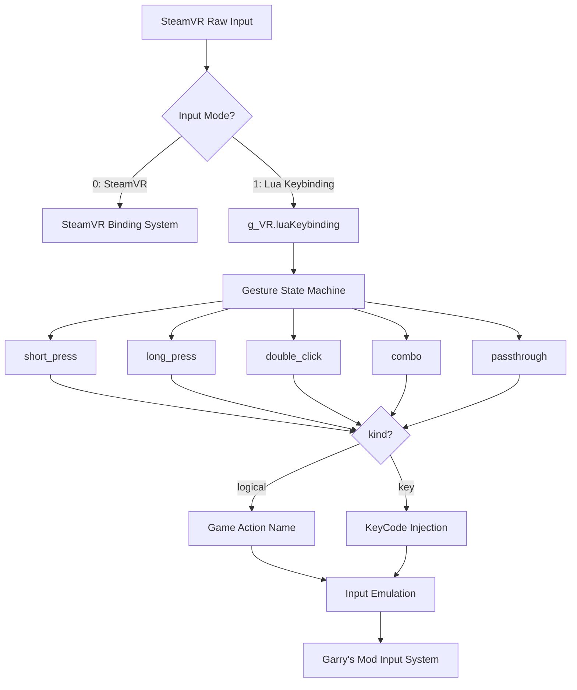
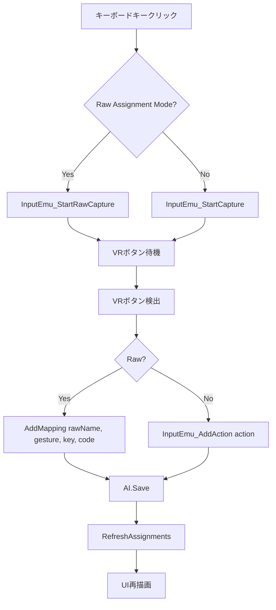

# Phase 2 実装解析 — `g_VR.advancedInput` → `g_VR.luaKeybinding` 移行

**日付:** 2026-04-17
**トピック:** Lua Keybinding API 統一と UI ファイルの修正

---

## 1. 関連ファイル一覧

| ファイルパス | 役割 |
|-------------|------|
| [`lua/vrmodunoffcial/vrmod_lua_keybinding.lua`](lua/vrmodunoffcial/vrmod_lua_keybinding.lua) | コアモジュール — マッピング管理の中枢 |
| [`lua/vrmodunoffcial/vrmod_add_keyboard.lua`](lua/vrmodunoffcial/vrmod_add_keyboard.lua) | キーボードUI — 1395行 |
| [`lua/autorun/client/vrmod_input_emu_keyboard_ui.lua`](lua/autorun/client/vrmod_input_emu_keyboard_ui.lua) | 代替キーボードUI — 865行 |

---

## 2. 変更内容

### 2.1 変数名変更: `g_VR.advancedInput` → `g_VR.luaKeybinding`

**変更前:**
```lua
local AI = g_VR.advancedInput
```

**変更後:**
```lua
local AI = g_VR.luaKeybinding
```

**変更箇所:**
- [`vrmod_add_keyboard.lua`](lua/vrmodunoffcial/vrmod_add_keyboard.lua): 5箇所
- [`vrmod_input_emu_keyboard_ui.lua`](lua/autorun/client/vrmod_input_emu_keyboard_ui.lua): 5箇所

### 2.2 API シグネチャ統一: `RemoveMapping(rm.index)` → `RemoveMapping(rm)`

**変更前 (古い呼び出し方):**
```lua
AI.RemoveMapping(rm.index)  -- 整数インデックスを渡す
```

**変更後 (新しい呼び出し方):**
```lua
AI.RemoveMapping(rm)  -- 完全なテーブルを渡す
```

---

## 3. コアモジュール [`vrmod_lua_keybinding.lua`](lua/vrmodunoffcial/vrmod_lua_keybinding.lua) 解説

### 3.1 概要

このファイルは VR コントローラの物理ボタン入力をゲームアクションにマッピングするシステムの中核です。



### 3.2 主要変数

| 変数名 | 型 | 用途 | 定義箇所 |
|--------|-----|------|---------|
| `g_VR.luaKeybinding` | table | マッピング管理のグローバルテーブル | 行27 |
| `LKB` | table | `g_VR.luaKeybinding` のローカル別名 | 行29 |
| `cv_inputmode` | ConVar | 入力モード切替 (0=SteamVR, 1=Lua) | 行75 |
| `LKB.mapping` | table | オンフット時のマッピング辞書 | 動的作成 |
| `LKB.drivingMapping` | table | 運転時のマッピング辞書 | 動的作成 |
| `LKB.rawValues` | table | 生のVRコントローラ入力値 | 動的更新 |

### 3.3 主要関数

| 関数名 | 引数 | 戻り値 | 説明 |
|--------|------|--------|------|
| `LKB.AddMapping()` | `rawName`, `gesture`, `kind`, `target`, `opts` | boolean | マッピングルールを追加 |
| `LKB.RemoveMapping()` | `rm` (table) | boolean | マッピングルールを削除 |
| `LKB.Save()` | なし | なし | マッピングをディスクに保存 |
| `LKB.GetKeyReverseMap()` | なし | table | キーコード→マッピングの逆引きマップ |
| `LKB.GetGestureDisplayName()` | `gesture` | string | ジェスチャーの表示名を取得 |
| `LKB.GetShortRawName()` | `rawName` | string | Rawアクションの短縮名を取得 |
| `LKB.GetShortGestureChar()` | `gesture` | string | ジェスチャーの短縮記号を取得 |

### 3.4 `AddMapping` シグネチャ詳細

```lua
-- 行1596
function LKB.AddMapping(rawName, gesture, kind, target, opts)
```

| パラメータ | 型 | 説明 |
|-----------|-----|------|
| `rawName` | string | 物理ボタンの名前 (例: `"raw_right_b"`) |
| `gesture` | string | ジェスチャータイプ: `"passthrough"`, `"short_press"`, `"long_press"`, `"double_click"`, `"combo"` |
| `kind` | string | `"logical"` (アクション名) または `"key"` (キーコード) |
| `target` | string\|number | ロジカルモード: アクション名、キーモード: キーコード数値 |
| `opts` | table | オプション: `{ combo_partner = "...", context = "on_foot"|"driving"|"both" }` |

### 3.5 `RemoveMapping` シグネチャ詳細

```lua
-- 行1627
function LKB.RemoveMapping(rm)
```

| パラメータ | 型 | 説明 |
|-----------|-----|------|
| `rm` | table | 削除対象のエントリ: `{ raw, gesture, kind, target, context }` |

**動作:**
1. `rm` が数値の場合 → 警告出力して false を返す（後方互換性）
2. `rm` がテーブルでない、または `rm.raw` が存在しない → false を返す
3. `context` を取得（デフォルト: `"on_foot"`）
4. 対応するマッピングテーブルから一致するルールを検索・削除
5. 削除成功時、ディスクに保存

---

## 4. UI ファイルの動作

### 4.1 [`vrmod_add_keyboard.lua`](lua/vrmodunoffcial/vrmod_add_keyboard.lua)

**5箇所の `g_VR.luaKeybinding` 参照:**

| 行番号 | 用途 |
|--------|------|
| 539 | `RefreshAssignments()` — 逆引きマップ取得 |
| 755 | `PaintKeyButton()` — Raw割り当て表示 |
| 903 | `OnKeyClicked()` — ステータスラベル更新 |
| 920 | `OnKeyClicked()` — `AddMapping` 呼び出し |
| 1003 | `OnRightClick()` — `RemoveMapping` 呼び出し |

**割り当てフロー:**


**削除フロー (行1003-1016):**
```lua
-- 行1003-1016
local AI = g_VR.luaKeybinding
for _, rm in ipairs(btn.assignedRawMappings) do
    local displayName = AI and (AI.GetShortRawName(rm.raw) .. " [" .. AI.GetGestureDisplayName(rm.gesture) .. "]") or rm.raw
    menu:AddOption(L("Remove Raw:", "Remove Raw:") .. " " .. displayName, function()
        if AI and AI.RemoveMapping then
            AI.RemoveMapping(rm)  -- ← 修正済み: rm テーブル全体を渡す
            AI.Save()
        end
        RefreshAssignments()
        -- ステータス更新
    end)
end
```

### 4.2 [`vrmod_input_emu_keyboard_ui.lua`](lua/autorun/client/vrmod_input_emu_keyboard_ui.lua)

**5箇所の `g_VR.luaKeybinding` 参照:**

| 行番号 | 用途 |
|--------|------|
| 172 | `PaintKeyButton()` — Raw割り当て表示 |
| 266 | `RefreshAssignments()` — 逆引きマップ取得 |
| 323 | `ShowRawDropdown()` — ドロップダウン表示 |
| 359 | `OnKeyClicked()` — ステータスラベル更新 |
| 575 | `OnRightClick()` — `RemoveMapping` 呼び出し |

**削除フロー (行574-586):**
```lua
-- 行574-586
if hasRaw then
    local AI = g_VR and g_VR.luaKeybinding
    for _, rm in ipairs(self.assignedRawMappings) do
        local displayName = AI and (AI.GetShortRawName(rm.raw) .. " [" .. AI.GetGestureDisplayName(rm.gesture) .. "]") or rm.raw
        menu:AddOption("Remove Raw: " .. displayName, function()
            if AI and AI.RemoveMapping then
                AI.RemoveMapping(rm)  -- ← 修正済み: rm テーブル全体を渡す
                AI.Save()
            end
            RefreshKeyStates()
            UpdateStatus("Removed: " .. displayName .. " from [" .. self.keyLabel .. "]")
        end)
    end
end
```

---

## 5. `GetKeyReverseMap` と `RemoveMapping` のデータ整合性

`GetKeyReverseMap` が返すテーブル形式:
```lua
{
    [KEY_A] = {
        { raw = "raw_right_b", gesture = "short_press", kind = "key", target = KEY_A, context = "on_foot" },
        -- ...
    },
    [KEY_B] = { ... },
}
```

`RemoveMapping` が受け取る形式:
```lua
{ raw = "raw_right_b", gesture = "short_press", kind = "key", target = KEY_A, context = "on_foot" }
```

**整合性:** `GetKeyReverseMap` の出力をそのまま `RemoveMapping` に渡せる設計。

---

## 6. 現在の動作まとめ

1. **入力モード切替:** `vrmod_unoff_inputmode` ConVar (0=SteamVR, 1=Lua)
2. **Luaモード有効時:** SteamVRバインディングをバイパスし、Luaでマッピングを処理
3. **ジェスチャー認識:** short_press, long_press, double_click, combo, passthrough
4. **キーボードUI:** 2つのUIファイルが `g_VR.luaKeybinding` を介してマッピング追加/削除
5. **削除API:** `RemoveMapping(rm)` — `rm` テーブル全体を渡し、内部で一致するルールを検出して削除
6. **永続化:** `Save()` でマッピングをディスクに保存
