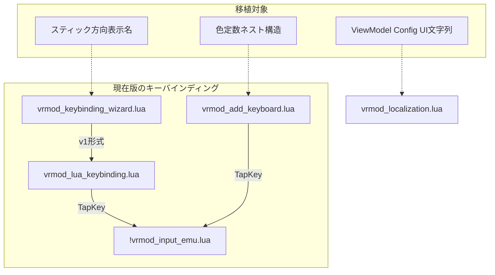
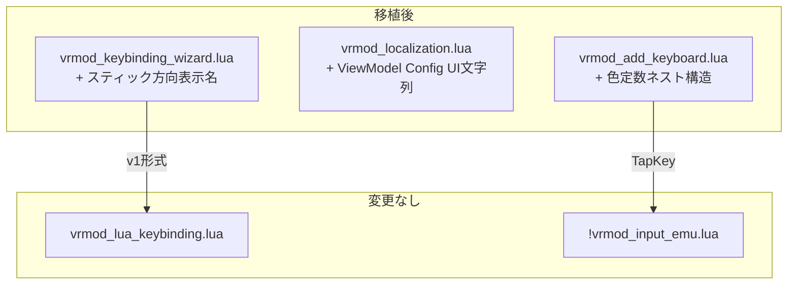

# 失敗版（20260513failed）からの移植可能な改善要素

## 1. 概要

### 目的
失敗版（20260513failed）から現在版（vrmod_semiofficial）へ「Raw Inputマッピングシステム以外」で移植可能な改善要素を特定し、安全なポート計画を提供する。

### 背景
- 失敗版はVRコントローラーのキーボードエミュレーションを改善しようとしたが、Raw Inputの導入により複雑化し迷走
- 開発期間中はRaw Input以外にも複数の改善要素が含まれていた
- 現在版は簡素化されたが、一部の有用な改善が失われている可能性あり

### 制約条件
- **Raw Inputマッピングシステムは移植対象外**（複雑化の原因）
- コードの依存関係が最小限のもののみを優先
- 現在版のアーキテクチャと互換性があることを確認

---

## 2. 差異ファイル一覧

| ファイル | 現在版 | 失敗版 | 差分 | 主な差異 |
|---------|-------|-------|------|---------|
| `vrmod_lua_keybinding.lua` | 772行 | 1736行 | +964行 | Raw Inputマッピング（**移植対象外**） |
| `!vrmod_input_emu.lua` | 782行 | 1051行 | +269行 | Rawキャプチャ関数（**移植対象外**） |
| `vrmod_input_emu_keyboard_ui.lua` | 651行 | 865行 | +214行 | RawマッピングUI（**移植対象外**） |
| `vrmod_add_keyboard.lua` | 1206行 | 1395行 | +189行 | **色定数のネスト構造** ✅ |
| `vrmod_keybinding_wizard.lua` | 885行 | 937行 | +52行 | **スティック方向表示名** ✅ |
| `vrmod_localization.lua` | 370行 | 434行 | +64行 | **ViewModel Config UI文字列** ✅ |
| `vrmod_viewmodelinfo.lua` | 508行 | 514行 | +6行 | ほぼ同一 |
| `vrmod_defaults.lua` | 274行 | 262行 | -12行 | 現在版にAdaptive FPS追加 |
| `vrmod_settings02_registry.lua` | 474行 | 454行 | -20行 | 現在版にAdaptive FPS設定追加 |

---

## 3. 移植可能な改善要素

### 3.1 ✅ スティック方向の表示名追加（高優先度）

**対象ファイル**: [`vrmod_keybinding_wizard.lua`](lua/vrmodunoffcial/vrmod_keybinding_wizard.lua:23)

**現状の問題**:
現在版の `RAW_DISPLAY_NAMES` はスティック本体のみで、方向分解（上下左右）が含まれていない。

```lua
-- 現在版（不足している）
local RAW_DISPLAY_NAMES = {
    raw_right_stick        = "Right Stick",
    raw_left_stick         = "Left Stick",
    -- スティック方向がない
}
```

**失敗版の改善**:
スティックの4方向分解表示名が含まれている。

```lua
-- 失敗版（完全な実装）
local RAW_DISPLAY_NAMES = {
    -- ... 省略 ...
    raw_left_stick_up      = "Left Stick ↑",
    raw_left_stick_down    = "Left Stick ↓",
    raw_left_stick_left    = "Left Stick ←",
    raw_left_stick_right   = "Left Stick →",
    raw_right_stick_up     = "Right Stick ↑",
    raw_right_stick_down   = "Right Stick ↓",
    raw_right_stick_left   = "Right Stick ←",
    raw_right_stick_right  = "Right Stick →",
}
```

**移植の利点**:
- ワイザードでスティック方向を明確に表示可能
- Raw Inputシステムに依存しない独立した改善
- コード追加は8行のみ

**リスク**: なし（純粋なデータ追加）

---

### 3.2 ✅ ViewModel Config UIのローカライゼーション文字列（中優先度）

**対象ファイル**: [`vrmod_localization.lua`](lua/vrmodunoffcial/vrmod_localization.lua:75)

**現状の問題**:
現在版の各言語テーブルには「ViewModel Config UI」関連の文字列が含まれていない。

```lua
-- 現在版（ViewModel Config UI文字列なし）
VRMOD_LANG.en = {
    msg_language_set = "Language set to: ",
    msg_unknown_category = "Error: Unknown category",
    -- ここで終了
}
```

**失敗版の改善**:
全4言語（en/ja/zh/ru）でViewModel Config UIの文字列が定義されている。

```lua
-- 失敗版（ViewModel Config UI文字列あり）
VRMOD_LANG.en = {
    -- ... 省略 ...
    -- ViewModel Config UI
    frame_vm_config = "Weapon ViewModel Configuration",
    frame_vm_edit = "Edit ViewModel Config",
    frame_vm_add = "Add ViewModel Config",
    col_vm_class = "Weapon Class",
    col_vm_offset_pos = "Offset Position",
    col_vm_offset_ang = "Offset Angle",
    btn_vm_new = "New",
    btn_vm_reset_current = "Reset Current Weapon",
    btn_vm_auto_adjust = "Auto Adjust",
    btn_vm_reset_zero = "Reset to Zero",
    btn_vm_apply = "Apply",
    btn_vm_cancel = "Cancel",
    label_vm_offset_pos = "Offset Position:",
    label_vm_offset_ang = "Offset Angle:",
    tooltip_vm_slider_drag = "Tip: Drag slider labels for fine adjustment",
}
```

**移植の利点**:
- [`vrmod_viewmodelinfo.lua`](lua/vrmodunoffcial/vrmod_viewmodelinfo.lua:338) のGUIでハードコードされた文字列をローカライズ可能に
- 多言語ユーザーのUX向上
- Raw Inputに依存しない独立した改善

**リスク**: 低（文字列追加のみ）

**対応が必要な言語**:
| 言語 | 行数 | 状態 |
|-----|------|------|
| English (en) | 16行 | 移植必要 |
| Japanese (ja) | 16行 | 移植必要 |
| Chinese (zh) | 16行 | 移植必要 |
| Russian (ru) | 16行 | 移植必要 |

---

### 3.3 ✅ 色定数のネスト構造（中優先度）

**対象ファイル**: [`vrmod_add_keyboard.lua`](lua/vrmodunoffcial/vrmod_add_keyboard.lua:44)

**現状の問題**:
現在版はフラットな変数名を使用しており、可読性と保守性が低い。

```lua
-- 現在版（フラット変数）
local CLR_BLACK_128 = Color(0, 0, 0, 128)
local CLR_BLACK_160 = Color(0, 0, 0, 160)
local CLR_INKEY_BG = Color(20, 20, 25, 220)
local CLR_INKEY_BG_HOVER = Color(60, 60, 70, 230)
-- ... 多数のフラット変数
```

**失敗版の改善**:
用途別にネストされたテーブル構造を使用。

```lua
-- 失敗版（ネスト構造）
local CLR = {
    BLACK_128   = Color(0, 0, 0, 128),
    BLACK_160   = Color(0, 0, 0, 160),
    WHITE       = Color(255, 255, 255),
    GREEN_FLASH = Color(0, 255, 0),
    -- ...
}

local CLR_INKEY = {
    BG         = Color(20, 20, 25, 220),
    BG_HOVER   = Color(60, 60, 70, 230),
    BORDER     = Color(80, 80, 90),
    -- ...
}

local CLR_ASGN = {
    BG         = Color(42, 42, 48, 235),
    YES_BG     = Color(25, 85, 35, 235),
    -- ...
}

local CLR_BAR = { /* ... */ }
local CLR_RAW = { /* ... */ }  -- Raw用（移植時は省略可能）
local CLR_UI = { /* ... */ }
```

**移植の利点**:
- 色定数の用途が明確に分類される
- 新規色の追加が容易
- テーマ変更時のメンテナンス性向上

**リスク**: 中（既存コードの参照箇所をすべて更新する必要あり）

**対策**:
- `CLR_RAW` はRaw Input関連のため省略
- 検索置換で `CLR_INKEY_BG` → `CLR_INKEY.BG` に一括変換
- 段階的に適用可能

---

### 3.4 ⚠️ v1/v2マッピング変換関数（低優先度・検討必要）

**対象ファイル**: [`vrmod_keybinding_wizard.lua`](lua/vrmodunoffcial/vrmod_keybinding_wizard.lua:134)

**現状の問題**:
現在版のワイザードはv1形式（rawName → logical文字列）のみを扱っている。

```lua
-- 現在版
local function FindRawForLogical(logicalName)
    for raw, logical in pairs(wizardState.pendingMapping) do
        if logical == logicalName then return raw end
    end
    return nil
end
```

**失敗版の改善**:
v1/v2形式間の相互変換関数を含む。

```lua
-- 失敗版（変換関数あり）
local function V2RuleListToV1String(ruleList)
    if type(ruleList) == "string" then return ruleList end
    if type(ruleList) == "table" and ruleList[1] and ruleList[1].target then
        return ruleList[1].target
    end
    return nil
end

local function CopyV2MappingToV1(v2)
    local out = {}
    for rawName, val in pairs(v2) do
        local s = V2RuleListToV1String(val)
        if s then out[rawName] = s end
    end
    return out
end

local function V1MappingToV2(v1)
    local out = {}
    for rawName, logical in pairs(v1) do
        if logical and logical ~= "" then
            out[rawName] = { { target = logical, trigger = "passthrough" } }
        end
    end
    return out
end
```

**移植の利点**:
- 将来のマッピング形式アップグレードに備えられる
- LKB.mappingとの境界処理が明確

**リスク**: 高（現在版のLKBがv2形式をサポートしていないため、現時点では無意味）

**推奨**: 保留。LKB側の変更と連動して検討。

---

## 4. 移植しない要素（Raw Input関連）

以下の要素は複雑化の原因となるため、移植対象外とする。

| 要素 | ファイル | 理由 |
|-----|---------|------|
| Rawキャプチャ関数 | `!vrmod_input_emu.lua` | メインの複雑化原因 |
| RawマッピングUI | `vrmod_input_emu_keyboard_ui.lua` | BlueカラーUI、`ShowRawDropdown` |
| LKB Polling Think | `!vrmod_input_emu.lua` | `LKB_Polling_Think` 全体 |
| ルールベース処理 | `vrmod_lua_keybinding.lua` | `ProcessRawInput`, `ApplyRuleTarget` など |
| ジェスチャ状態管理 | `vrmod_lua_keybinding.lua` | `UpdateGestureState` |
| スティック方向派生 | `vrmod_lua_keybinding.lua` | `DeriveStickDirections` |
| 移行関数 | `vrmod_lua_keybinding.lua` | `MigrateMappingV1toV2`, `ImportAdvancedInputIfPresent` |

---

## 5. アーキテクチャ

### 現在の構造



### 移植後の構造



---

## 6. 実装計画

### ステップ1: スティック方向表示名の追加

**対象ファイル**: [`vrmod_keybinding_wizard.lua`](lua/vrmodunoffcial/vrmod_keybinding_wizard.lua:38)

**作業内容**:
1. `RAW_DISPLAY_NAMES` に8つのスティック方向エントリを追加（行40前後）

**追加コード**:
```lua
    raw_left_stick_up      = "Left Stick ↑",
    raw_left_stick_down    = "Left Stick ↓",
    raw_left_stick_left    = "Left Stick ←",
    raw_left_stick_right   = "Left Stick →",
    raw_right_stick_up     = "Right Stick ↑",
    raw_right_stick_down   = "Right Stick ↓",
    raw_right_stick_left   = "Right Stick ←",
    raw_right_stick_right  = "Right Stick →",
```

**リスク**: なし
**工数**: 5分

---

### ステップ2: ViewModel Config UIのローカライゼーション文字列追加

**対象ファイル**: [`vrmod_localization.lua`](lua/vrmodunoffcial/vrmod_localization.lua:74)

**作業内容**:
1. `VRMOD_LANG.en` に16行追加（行74前後）
2. `VRMOD_LANG.ja` に16行追加（行141前後）
3. `VRMOD_LANG.zh` に16行追加（行208前後）
4. `VRMOD_LANG.ru` に16行追加（行275前後）

**英語追加例**:
```lua
    -- ViewModel Config UI
    frame_vm_config = "Weapon ViewModel Configuration",
    frame_vm_edit = "Edit ViewModel Config",
    frame_vm_add = "Add ViewModel Config",
    col_vm_class = "Weapon Class",
    col_vm_offset_pos = "Offset Position",
    col_vm_offset_ang = "Offset Angle",
    btn_vm_new = "New",
    btn_vm_reset_current = "Reset Current Weapon",
    btn_vm_auto_adjust = "Auto Adjust",
    btn_vm_reset_zero = "Reset to Zero",
    btn_vm_apply = "Apply",
    btn_vm_cancel = "Cancel",
    label_vm_offset_pos = "Offset Position:",
    label_vm_offset_ang = "Offset Angle:",
    tooltip_vm_slider_drag = "Tip: Drag slider labels for fine adjustment",
```

**リスク**: 低（文字列追加のみ）
**工数**: 30分

---

### ステップ3: 色定数のネスト構造へのリファクタリング

**対象ファイル**: [`vrmod_add_keyboard.lua`](lua/vrmodunoffcial/vrmod_add_keyboard.lua:44)

**作業内容**:
1. フラット変数をネストテーブルに置き換え
2. 参照箇所をすべて更新（検索置換）
3. `CLR_RAW` は省略（Raw Input不要のため）

**変換例**:
```lua
-- Before
local CLR_INKEY_BG = Color(20, 20, 25, 220)
-- 使用: CLR_INKEY_BG

-- After
local CLR_INKEY = {
    BG = Color(20, 20, 25, 220),
    -- ...
}
-- 使用: CLR_INKEY.BG
```

**リスク**: 中（参照箇所の見落としに注意）
**工数**: 60分

---

## 7. リスクと対策

| リスク | 影響 | 対策 |
|-------|------|------|
| 色定数の参照箇所を見落とす | 実行時エラー | 検索置換後に全文検索で確認 |
| ローカライゼーションキーの競合 | 文字列が正しく表示されない | 既存キーとの重複を確認 |
| スティック方向名の未使用 | コードの肥大化 | 現時点では無害（将来拡張用） |

---

## 8. 推奨移植順序

1. **ステップ1**（スティック方向表示名）- リスクなし、即座に適用可能
2. **ステップ2**（ViewModel Config UI文字列）- 低リスク、多言語対応改善
3. **ステップ3**（色定数ネスト構造）- 中リスク、リファクタリング必要

---

## 9. 現在版の独自機能（維持すべき）

現在版で追加された以下の機能は維持する。

| 機能 | ファイル | 説明 |
|-----|---------|------|
| Adaptive FPS | [`vrmod_adaptive_fps.lua`](lua/vrmodunoffcial/1/vrmod_adaptive_fps.lua) | 品質ティア0-6の自動FPS最適化 |
| Adaptive FPS設定 | [`vrmod_defaults.lua`](lua/vrmodunoffcial/vrmod_defaults.lua:178) | `adaptive` カテゴリのデフォルト値 |
| Adaptive FPSレジストリ | [`vrmod_settings02_registry.lua`](lua/vrmodunoffcial/1/vrmod_settings02_registry.lua:211) | 設定メニューへの統合 |

---

## 10. まとめ

失敗版から移植可能な改善要素は以下の3つに限定される。

| 改善要素 | 優先度 | リスク | 工数 |
|---------|-------|-------|------|
| スティック方向表示名 | 高 | なし | 5分 |
| ViewModel Config UI文字列 | 中 | 低 | 30分 |
| 色定数ネスト構造 | 中 | 中 | 60分 |

これらはすべてRaw Inputシステムに依存せず、現在版のアーキテクチャと完全に互換性がある。

**コード編集が必要な場合は「💻 実行モード」に切り替えてください。**
