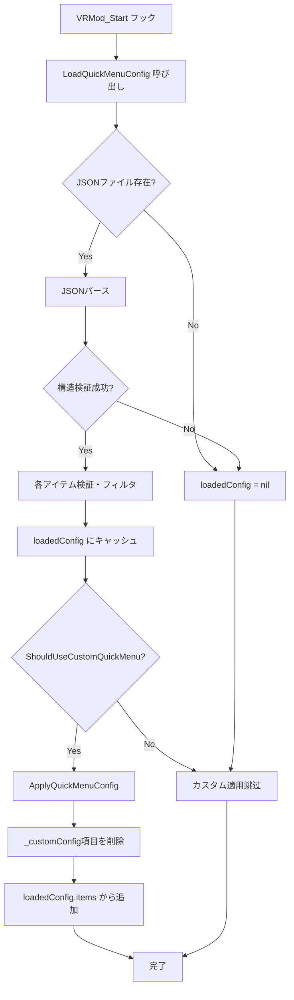

# vrmod_quickmenu_config.lua — クイックメニュー設定システム

**ファイルパス**: `lua/vrmodunoffcial/vrmod_quickmenu_config.lua`
**行数**: 285行
**種別**: クライアントサイド
**役割**: クイックメニューのJSON設定ファイル読み書き・カスタムメニュー項目の適用・リセット

---

## 1. ファイル概要

このファイルは「クイックメニュー設定」の**永続化・管理**を担当する。JSONファイル（`vrmod/quickmenu_config.json`）にメニュー項目の構成を保存・読み込み、カスタムメニューの有効無効を切り替えることができる。

### 主な機能
- JSON設定ファイルの読み書き（`vrmod/quickmenu_config.json`）
- メニュー項目のバリデーション（構造チェック）
- カスタム設定の適用・デフォルトへのリセット
- `vrmod_quickmenu_use_custom` ConVarによる有効切り替え

---

## 2. ConVar一覧

| ConVar名 | デフォルト | 説明 |
|---------|-----------|------|
| `vrmod_quickmenu_use_custom` | `1` | カスタムクイックメニュー設定の使用有無（0=無効/デフォルト、1=有効/カスタム） |

---

## 3. 設定ファイル形式

### ファイルパス
```
steamapps/common/GarrysMod/garrysmod/data/vrmod/quickmenu_config.json
```

### JSON構造
```json
{
  "version": 1,
  "items": [
    {
      "name": "ボタン表示名",
      "slot": 0,
      "slotPos": 0,
      "actionType": "convar_toggle",
      "actionValue": "vrmod_fov"
    },
    {
      "name": "コマンド実行",
      "slot": 1,
      "slotPos": 0,
      "actionType": "command",
      "actionValue": "impulse 100"
    },
    {
      "name": "キー押下",
      "slot": 2,
      "slotPos": 0,
      "actionType": "key_press",
      "actionValue": "1"
    }
  ]
}
```

### メニュー項目バリデーションルール
| フィールド | 型 | 制約 |
|-----------|-----|------|
| `name` | string | 空文字不可 |
| `slot` | number | 0〜5 |
| `slotPos` | number | 0〜20 |
| `actionType` | string | `convar_toggle` / `command` / `key_press` のいずれか |
| `actionValue` | string | 空文字不可 |
| `actionValue` (key_press) | number | 1以上（キーコード） |

---

## 4. 主要関数・構造体

### グローバル状態
```lua
local CONFIG_FILE_PATH = "vrmod/quickmenu_config.json"
local CONFIG_VERSION = 1
local loadedConfig = nil        -- 読み込み済み設定（キャッシュ）
local configApplied = false     -- 設定適用済みフラグ
```

### バリデーション関数

#### EnsureDataDirectory()
- **役割**: `data/vrmod/` ディレクトリ存在確認・作成
```lua
if not file.IsDir("vrmod", "DATA") then
    file.CreateDir("vrmod")
end
```

#### ValidateMenuItem(item)
- **役割**: 単一メニュー項目の構造検証
- **返値**: true=有効、false=無効

#### ValidateConfig(config)
- **役割**: 設定全体の構造検証
- **チェック**: `version` number、`items` table の存在

### コアAPI関数

#### vrmod.LoadQuickMenuConfig()
- **返値**: table（設定）または nil（ファイルなし/無効）
- **処理フロー**:
  1. `EnsureDataDirectory()` でディレクトリ確認
  2. `file.Exists(CONFIG_FILE_PATH, "DATA")` でファイル存在チェック
  3. `file.Read()` でJSON文字列読み込み
  4. `util.JSONToTable()` でパース
  5. `ValidateConfig()` で構造検証
  6. 各アイテムを `ValidateMenuItem()` で検証、無効アイテムをフィルタリング
  7. `loadedConfig` にキャッシュ

#### vrmod.SaveQuickMenuConfig(items)
- **引数**: table（メニュー項目定義の配列）
- **返値**: boolean（成功/失敗）
- **処理フロー**:
  1. 各アイテムを `ValidateMenuItem()` で検証
  6. 有効アイテムのみを選択して `config` テーブルを作成
  7. `util.TableToJSON(config, true)` でJSONシリアライズ
  8. `file.Write()` でファイル書き込み
  9. `loadedConfig` にキャッシュ

#### vrmod.GetQuickMenuConfig()
- **返値**: table（`loadedConfig`）または nil

#### vrmod.ShouldUseCustomQuickMenu()
- **返値**: boolean
- **判定条件**:
  - `vrmod_quickmenu_use_custom` ConVarがtrue
  - `loadedConfig` が存在
  - `loadedConfig.items` の長さが0より大きい

#### CreateActionFunction(item)
- **役割**: メニュー項目定義からアクション関数を作成
- **actionType別処理**:
  | 型 | 動作 |
  |---|------|
  | `convar_toggle` | ConVarのbool値を反転して実行 |
  | `command` | `LocalPlayer():ConCommand()` でコマンド実行 |
  | `key_press` | `vrmod.InputEmu_TapKey()` でキー押下エミュレート |

#### vrmod.ApplyQuickMenuConfig()
- **返値**: boolean（成功/失敗）
- **処理フロー**:
  1. `ShouldUseCustomQuickMenu()` でカスタム設定使用可否チェック
  2. `g_VR.menuItems` から `_customConfig` フラグ付き項目を削除
  3. `loadedConfig.items` から各項目を `CreateActionFunction()` でアクション関数化
  4. `_customConfig = true` フラグ付きで `g_VR.menuItems` に追加

#### vrmod.ResetQuickMenuToDefault()
- **返値**: boolean（成功/失敗）
- **処理**: `g_VR.menuItems` から `_customConfig` フラグ付き項目を削除

#### vrmod.GetCurrentMenuItems()
- **返値**: table（設定項目配列）または空テーブル
- `loadedConfig.items` を返す（なければ空）

#### vrmod.ExportCurrentMenuToConfig()
- **返値**: table（設定形式に変換された項目）
- `g_VR.menuItems` から `_customConfig` 以外の項目を設定形式に変換

---

## 5. メインフロー図



---

## 6. ConVar変更コールバック

```lua
cvars.AddChangeCallback("vrmod_quickmenu_use_custom", function(name, old, new)
    if tobool(new) then
        vrmod.ApplyQuickMenuConfig()  -- カスタム適用
    else
        vrmod.ResetQuickMenuToDefault()  -- デフォルトに戻す
    end
end, "VRMod_QuickMenuConfig")
```

---

## 7. 他ファイルとの依存関係

| 依存ファイル | 関係 |
|------------|------|
| `vrmod.lua` | `g_VR.menuItems` を読み書き |
| `vrmod_ui_quickmenu.lua` | `g_VR.menuItems` からボタン描画 |
| `vrmod_quickmenu_editor.lua` | 設定エディタから `vrmod.SaveQuickMenuConfig` を使用 |
| `vrmod_input.lua` | `vrmod.InputEmu_TapKey` を key_press アクションで使用 |

---

## 8. VR関連の注意点

1. **データディレクトリ**: `data/vrmod/` を使用（GModのユーザーデータディレクトリ）
2. **非同期適用**: `timer.Simple(0.5, ...)` でVRMod_Start後0.5秒delayして適用（`g_VR` 初期化待ち）
3. **フラグ管理**: `_customConfig` フラグでカスタム項目を識別、削除時に使用
4. **エラートラップ**: `ErrorNoHalt()` でパース失敗・書き込み失敗をコンソール出力（ゲーム停止なし）

---

## 9. アクションタイプ详解

### convar_toggle
```lua
-- ConVarのbool値を反転
local cvar = GetConVar(item.actionValue)
if cvar then
    local current = cvar:GetBool()
    RunConsoleCommand(item.actionValue, current and "0" or "1")
end
```

### command
```lua
-- GModコマンドを直接実行
LocalPlayer():ConCommand(item.actionValue)
```

### key_press
```lua
-- キーコードをエミュレート
local code = tonumber(item.actionValue)
if code and code > 0 and vrmod and vrmod.InputEmu_TapKey then
    vrmod.InputEmu_TapKey(code)
end
```

---

## 10. 特記事項

- `loadedConfig` はグローバル関数から参照可能（`vrmod.GetQuickMenuConfig()`）
- `configApplied` は内部フラグ（現在未使用）
- バージョン管理: `CONFIG_VERSION = 1`（将来のスキーマ変更用）
- JSONシリアライズ: `util.TableToJSON(config, true)`（pretty print有効）

---

*作成日: 2026/4/27*
*分析完了: vrmod_quickmenu_config.lua (285行)*