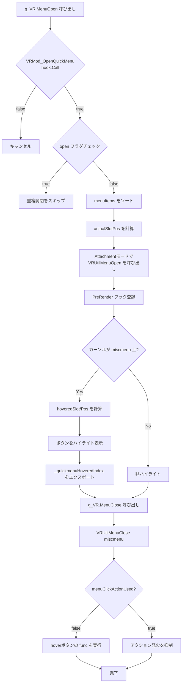

# vrmod_ui_quickmenu.lua — クイックメニュー表示システム

**ファイルパス**: `lua/vrmodunoffcial/vrmod_ui_quickmenu.lua`
**行数**: 130行
**種別**: クライアントサイド
**役割**: VRクイックメニュー（6列ボタングリッド）の表示・非表示・ハイライト制御

---

## 1. ファイル概要

このファイルは「クイックメニュー」の**表示ロジック**を担当する。`g_VR.MenuOpen()` / `g_VR.MenuClose()` を公開し、`vrmod_ui.lua` の `VRUtilMenuOpen` を使用して3D空間にパネルを配置する。

### 主な機能
- `g_VR.menuItems` からボタン項目を取得・ソート
- 6列×複数行のグリッドレイアウトでボタンを描画
- `PreRender` フックで毎フレームハイライト状態を更新
- メニュー閉閉時に hover 状態に応じたアクションを実行

---

## 2. ConVar一覧

| ConVar名 | デフォルト | 説明 |
|---------|-----------|------|
| `vrmod_attach_quickmenu` | 1 | クイックメニューのAttachment位置（0-4） |

### Attachmentモードによる配置
| モード | 配置位置 |
|-------|---------|
| 1 | 左手コントローラー追従 |
| 2 | 右手コントローラー追従（デフォルト位置計算あり） |
| 3 | HMD追従 |
| 4 | プレイヤー原点追従 |

---

## 3. 主要関数・構造体

### グローバル状態
```lua
local open = false  -- メニュー開閉状態
```

### g_VR.MenuOpen()
- **役割**: クイックメニューを開く
- **処理フロー**:
  1. `hook.Call("VRMod_OpenQuickMenu")` で開閉許可をチェック（falseを返すとキャンセル）
  2. `open` フラグで重複開閉を防止
  3. `g_VR._menuClickActionUsed` をリセット
  4. `g_VR.menuItems` を `slot` → `slotPos` の順でソート
  5. `actualSlotPos` を再計算（スロット変更時の位置調整）
  6. Attachmentモードに応じて `VRUtilMenuOpen("miscmenu", 512, 512, ...)` を呼び出し
  7. `PreRender` フック `"vrutil_hook_renderigm"` を登録
     - メニューカーソル位置から `hoveredSlot`, `hoveredSlotPos` を計算
     - ボタンを黒背景（ハイライト時は不透過200、通常は128）で描画
     - ボタン名を `HudSelectionText` フォントで中央表示
     - `g_VR._quickmenuHoveredIndex` をエクスポート（クリックアクション処理用）
     - `VRUtilMenuRenderStart/End` でパネル描画

### g_VR.MenuClose()
- **役割**: クイックメニューを閉じる
- **処理**:
  1. `VRUtilMenuClose("miscmenu")` を呼び出し
  2. `quickmenuCloseFunc` 内で `PreRender` フックを解除
  3. `_menuClickActionUsed` がfalseの場合、以前hoverしていたボタンの `func()` を実行（アクション発火）

### quickmenuCloseFunc（ローカル関数）
- **役割**: メニュー閉閉時のクリーンアップ + アクション発火制御
- **処理**:
  1. `PreRender` フックを解除
  2. `open = false`
  3. `_quickmenuHoveredIndex` をリセット
  4. `_menuClickActionUsed` がfalseでhover項目がある場合、その `func()` を実行
     - **重要**: クリックアクションが既に使用されている場合は発火を抑制（ダブル発火防止）

---

## 4. メインフロー図



---

## 5. ボタンレイアウト計算

### グリッド配置
- ボタンサイズ: 82×53 ピクセル
- ギャップ: `(512 - 82 * 6) / 5 = 4` ピクセル
- 位置: `x * (82 + 4)`, `230 + y * (53 + gap)`
- 230のオフセットは上部スペース用

### ソートロジック
```lua
-- slotが小さい順、同じslotならslotPosが小さい順
if items[i].slot > slot or items[i].slot == slot and items[i].slotPos > slotPos then
    index = i
    break
end
```

---

## 6. 他ファイルとの依存関係

| 依存ファイル | 関係 |
|------------|------|
| `vrmod_ui.lua` | `VRUtilMenuOpen/Close`, `VRUtilMenuRenderStart/End`, `VRUtilMenuRenderPanel` を使用 |
| `vrmod.lua` | `g_VR.tracking`, `g_VR.origin`, `g_VR.originAngle`, `g_VR.menuItems` を提供 |
| `vrmod_api.lua` | `vrmod.GetConvars` を使用 |
| `vrmod_ui_menu_clickactions.lua` | `g_VR._quickmenuHoveredIndex`, `VRMod_MenuClick` フックで連携 |
| `vrmod_menu.lua` | `g_VR.MenuOpen/Close` を呼び出す |

---

## 7. VR関連の注意点

1. **ハイライト状態の保存**: `prevHoveredItem` で前フレームのhover状態を保持し、変更時のみ再描画（パフォーマンス最適化）。
2. **クリックアクション制御**: `_menuClickActionUsed` フラグで、メニュー閉閉時のダブルアクション発火を防止。
3. **Attachmentモード2の特殊位置計算**: HMDのyawを基準に `tmp:Right()`, `tmp:Forward()` で相対位置を計算。
4. **512×512のRenderTarget**: 固定サイズ。6列ボタン用に最適化。

---

## 8. 特記事項

- `g_VR._quickmenuHoveredIndex` は他のUIファイル（クイックメニューアクション等）から参照される公開状態
- `draw.RoundedBox` で角丸ボタン、`draw.SimpleText` で複数行テキスト対応
- `string.Explode(" ", name)` でスペース区切りのボタン名を複数行表示

---

*作成日: 2026/4/27*
*分析完了: vrmod_ui_quickmenu.lua (130行)*