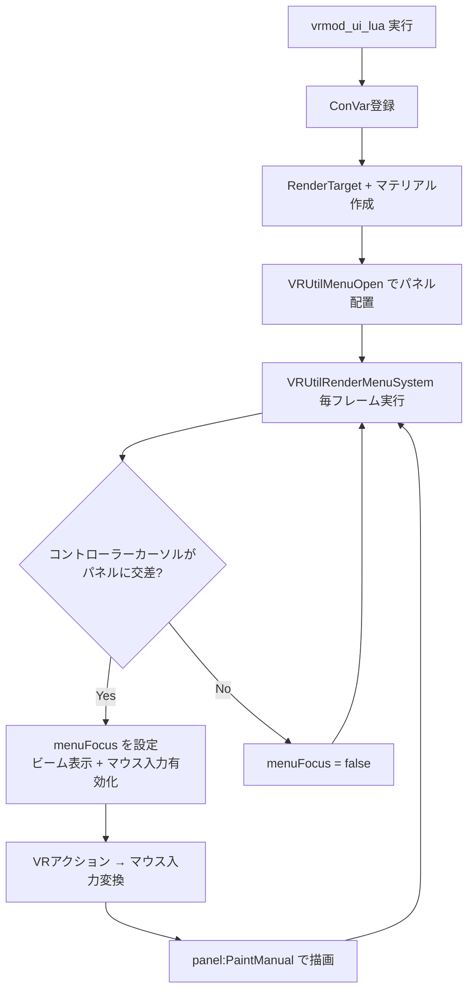

# vrmod_ui.lua — メインUIシステム

**ファイルパス**: `lua/vrmodunoffcial/vrmod_ui.lua`
**行数**: 394行
**種別**: クライアントサイド (`CLIENT` ブロック内)
**役割**: VR内3D空間に配置されたUIパネルの描画・カーソル検知・入力マッピング

---

## 1. ファイル概要

このファイルは「VR内メニュー」の**基盤システム**を提供する。GModの標準2Dパネルを3D空間に投影し、コントローラーカーソル（右ハンド）で操作する仕組み。

### 主な機能
- メニューパネルの3D空間への配置（ Attachment 方式: 左手/右手/HMD/原点）
- レンダーターゲット + マテリアルによる3Dスクリーン描画
- 右コントローラーからのレイ投射でパネル上のカーソル位置を計算
- GModのマウス入力（左/右/中クリック、ホイール）をVRアクションに変換

---

## 2. ConVar一覧

| ConVar名 | デフォルト | 説明 |
|---------|-----------|------|
| `vrmod_test_ui_testver` | 1 | テスト用UIバージョンフラグ（0-1） |
| `vrmod_ui_realtime` | 0 | リアルタイムUI更新（1で毎フレームレンダリング） |
| `vrmod_attach_weaponmenu` | 1 | 武器メニューのAttachment位置（0-4） |
| `vrmod_attach_quickmenu` | 1 | クイックメニューのAttachment位置（0-4） |
| `vrmod_attach_popup` | 1 | ポップアップのAttachment位置（0-4） |
| `vrmod_attach_heightmenu` | 2 | 高さ調整メニューのAttachment位置（0-2） |
| `vre_ui_attachtohand` | 1 | UIを手にアタッチするかどうか |
| `vrmod_unoff_desktop_ui_mirror` | 1 | VR UIパネルをデスクトップウィンドウにミラー表示 |
| `vrmod_ui_desktop_mirror` | 0 | 選択的デスクトップミラー（VRメニューはVR保持、ポップアップのみミラー） |
| `vrmod_ui_outline` | 1 | UIパネルの赤アウトライン表示（デバッグ用） |
| `vrmod_keyboard_uichatkey` | 1 | チャットキーでVRキーボードを起動 |
| `vrmod_dev_ui_rendertype_ex` | 0 | レンダリングタイプ切り替え（自動MIPMAP使用） |

### Attachment番号の意味
| 番号 | 対象 |
|-----|------|
| 0 | 固定位置（pos/ang直接使用） |
| 1 | 左手コントローラー追従 |
| 2 | 右手コントローラー追従 |
| 3 | HMD追従 |
| 4 | プレイヤー原点追従 |

---

## 3. 主要関数・構造体

### グローバル状態
```lua
g_VR = g_VR or {}
g_VR.menuFocus = false      -- 現在フォーカスされているメニューのUID
g_VR.menuCursorX = 0        -- カーソルX座標（パネル内ローカル）
g_VR.menuCursorY = 0        -- カーソルY座標（パネル内ローカル）
g_VR.menus = {}             -- メニューパネル辞書 {uid: menuData}
```

### VRUtilMenuOpen(uid, width, height, panel, attachment, pos, ang, scale, cursorEnabled, closeFunc)
- **役割**: メニューパネルを3D空間に配置
- **処理**:
  1. RenderTargetを作成（`GetRenderTargetEx` または `GetRenderTarget`）
  2. マテリアルを作成（`!vrmod_mat_ui_{uid}` または UnlitGeneric）
  3. `menuOrder` テーブルに追加
  4. `PostDrawTranslucentRenderables` フックに登録（`GetConVar("vrmod_useworldmodels")` がtrueの場合）
  5. パネルを `SetPaintedManually(true)` で手動描画モードに

### VRUtilMenuClose(uid)
- **役割**: メニューパネルを削除
- **処理**:
  1. パネルを `SetPaintedManually(false)` に戻す
  2. `closeFunc` を呼び出し
  3. `menuOrder` から削除
  4. 全メニューが消えたらフックを解除、`gui.EnableScreenClicker(false)`

### VRUtilMenuRenderPanel(uid)
- **役割**: メニューパネルをRenderTargetに描画
- **処理**:
  1. RenderTargetをプッシュ
  2. `cam.Start2D()` で2Dコンテキスト
  3. `panel:PaintManual()` でパネル描画
  4. `hook.Run("VRMod_PostRenderPanel", uid, menus[uid])` を呼び出し
  5. RenderTargetをポップ

### VRUtilRenderMenuSystem()
- **役割**: 全メニューパネルの3D描画 + カーソル検知（メインループ）
- **処理フロー**:
  1. 各メニューの位置をAttachmentに応じて計算（`LocalToWorld`）
  2. `cam.Start3D2D()` で3D空間に2Dパネルを描画
  3. マテリアルでテクスチャ表示、アウトライン描画（デバッグ）
  4. **カーソル検知**: 右手コントローラーからのレイがパネル面と交差する位置を計算
     - 公式: `dist = B / A` （`A = normal:Dot(dir)`, `B = normal:Dot(pos - start)`）
     - 最も近いパネルにフォーカスを設定
  5. フォーカス切り替え時に `SetMouseInputEnabled()` / `gui.EnableScreenClicker()` を制御
  6. カーソルがパネル上の場合、`render.DrawBeam()` でビーム表示
  7. `input.SetCursorPos()` でGModのカーソル位置を同期
  8. `vrmod_ui_realtime == 1` の場合、毎フレームパネルをレンダリング

### VRUtilIsMenuOpen(uid)
- **役割**: メニューが開いているかチェック

### VRUtilMenuRenderStart / VRUtilMenuRenderEnd
- **役割**: パーシャルレンダリング用の開始/終了関数

---

## 4. フック・コマンド

### フック: "VRMod_Input"
```lua
hook.Add("VRMod_Input", "ui", function(action, pressed))
```
VRアクションをGModマウス入力に変換:

| VRアクション | GModマウス入力 |
|-------------|---------------|
| `boolean_primaryfire` | 左クリック（Pressed/Released） |
| `boolean_secondaryfire` | 右クリック |
| `boolean_back` | ウィールダウン |
| `boolean_forword` | ウィールアップ |
| `boolean_reload` | 中クリック |
| `boolean_mouse4` | マウス4 |
| `boolean_mouse5` | マウス5 |
| `boolean_chat` | チャットキー → `vrmod_keyboard` コマンド |

**Desktop Mirror Mode対応**:
- `g_VR.desktopMirrorMode` かつ `not g_VR.menuFocus` の場合、入力をスキップ（デスクトップ側が処理）

### コマンド: `vrmod_lua_reset_ui`
- `vrmod_ui_lua()` を再実行してUIシステムをリセット

---

## 5. メインフロー図



---

## 6. 他ファイルとの依存関係

| 依存ファイル | 関係 |
|------------|------|
| `vrmod.lua` | `g_VR.tracking`, `g_VR.origin`, `g_VR.originAngle` を参照 |
| `vrmod_api.lua` | `vrmod.AddCallbackedConvar`, `vrmod.GetConvars` を使用 |
| `vrmod_ui_quickmenu.lua` | `VRUtilMenuOpen/Close` を使用してクイックメニューを生成 |
| `vrmod_ui_weaponselect.lua` | 同上、武器選択メニュー |
| `vrmod_ui_chat.lua` | チャットパネルのレンダリング |
| `vrmod_ui_menu_clickactions.lua` | `VRMod_MenuClick` フックをフックしてメニュークリック後のアクションを処理 |
| `vrmod_unoff_addmenu.lua` | デスクトップミラーモードとの連携 |

---

## 7. VR関連の注意点

1. **3D2D描画の制約**: GModの `cam.Start3D2D()` は距離によるスケール調整が必要。`v.scale` で調整。
2. **カーソル検知の数学**: レイ-平面交差計算を自行実装（SteamVRのRaycast機能を使わない理由はおそらくQuest互換性）。
3. **リアルタイム更新**: `vrmod_ui_realtime` が0の場合、メニューフォーカス時のみレンダリング（パフォーマンス重視）。1にすると毎フレーム更新（スライダー等リアルタイム更新が必要なUI向け）。
4. **Desktop Mirror Mode**: VRヘッドセット外でもUIを操作できるよう、デスクトップウィンドウにミラー表示する機能。`g_VR.desktopMirrorMode` フラグと連動。
5. **パフォーマンス**: 各メニューが1つのRenderTargetを消費する。过多メニューを開くとVRAM消費が増加。

---

## 8. 特記事項

- `vrmod._origVRUtilRenderMenuSystem` に元の関数を保存（上書き互換性のため）
- `DisableClipping` / `render.SetWriteDepthToDestAlpha` による詳細なレンダリング制御
- デバッグ用アウトライン表示 (`vrmod_ui_outline`)

---

*作成日: 2026/4/27*
*分析完了: vrmod_ui.lua (394行)*